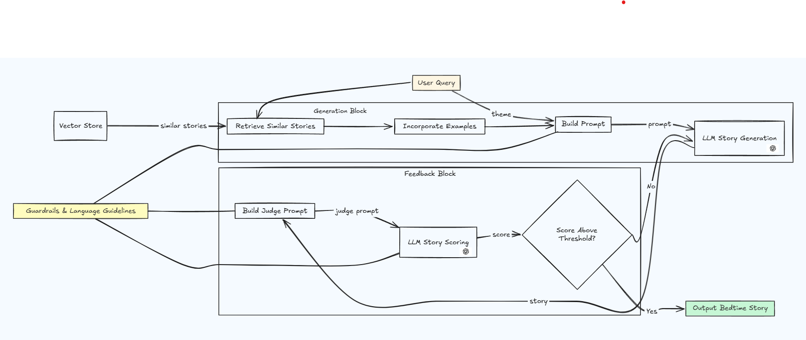

# Bedtime Story Generator

A RAG-based AI system that generates safe, soothing bedtime stories for children using GPT-3.5-turbo, with built-in safety guardrails and quality control.

## System Architecture



## How It Works

1. **Story Indexing**
   - Loads bedtime stories from CSV
   - Creates embeddings using sentence-transformers
   - Builds FAISS vector index for similarity search

   

2. **Story Generation**
   - Takes user's theme input
   - Retrieves similar stories from index
   - Generates new story using GPT-3.5-turbo
   - Applies comprehensive safety guardrails

3. **Quality Control**
   - Evaluates story against safety criteria
   - Scores on structure, engagement, and safety
   - Regenerates if below quality threshold (80/100)
   - Returns best version after max 5 attempts

## Quick Setup

1. **Installation**
   ```bash
   # Clone and setup
   git clone <repository-url>
   cd story_gen
   python -m venv venv

   # Activate virtual environment
   # Windows:
   .\venv\Scripts\activate
   # Unix/MacOS:
   source venv/bin/activate

   # Install dependencies
   pip install -r requirements.txt
   ```

2. **Configuration**
   ```bash
   # Create .env file with your OpenAI API key
   # Windows:
   echo OPENAI_API_KEY=your_api_key_here > .env
   # Unix/MacOS:
   echo "OPENAI_API_KEY=your_api_key_here" > .env
   ```

3. **Generate Stories**
   ```bash
   # Build index (required once)
   python -m bedtime_stories.cli index --csv stories.csv

   # Generate a story
   python -m bedtime_stories.cli tell "a friendly cloud that brings rainbow rain"

   # Generate with detailed feedback
   python -m bedtime_stories.cli tell "a friendly cloud that brings rainbow rain" --verbose
   ```

## Features

- Safe, child-friendly story generation
- Built-in story evaluation and feedback system
- Quality threshold enforcement
- Simple command-line interface
- Retrieval-augmented generation using similar stories
- Comprehensive safety guardrails

## Story Guidelines

The generator follows strict guidelines to ensure stories are:
- Age-appropriate (3-8 years)
- Soothing and calming
- Free of scary elements
- Simple to understand
- Engaging but not overstimulating
- Perfect for bedtime

## Example Story Themes

Try generating stories about:
- Gentle animals making friends
- Kind magical creatures
- Peaceful nature adventures
- Cozy bedtime routines
- Friendly helpers in the community

## Sample Stories

You can find example generated stories in `sample_stories.txt`, which were created using the `generate_sample_stories.ps1` script. These stories demonstrate various themes and the system's ability to generate engaging, child-friendly content.

## Future Work

1. **Part-Based Story Generation with Progressive Feedback**
   - Implement a staged generation pipeline (setup, rising action, climax, resolution) with component-specific evaluation
   - Use real-time feedback and context to guide subsequent parts while maintaining narrative coherence
   - This would also help overcome RAG limitations (if the chunked stories are big), with a part-by-part chunking strategy

2. **Story Part Collation and Smoothing System**
   - Develop an intelligent collation system to combine individually generated parts into cohesive stories
   - Implement context-aware smoothing to ensure seamless transitions between story segments

